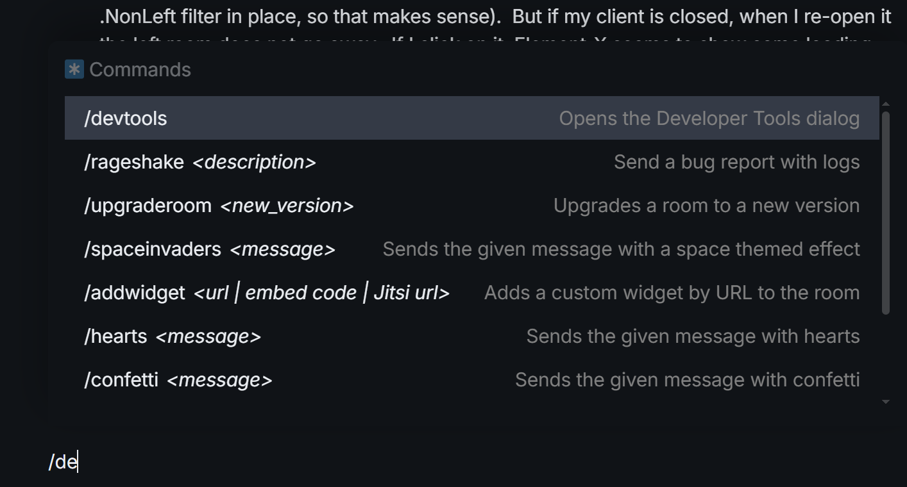
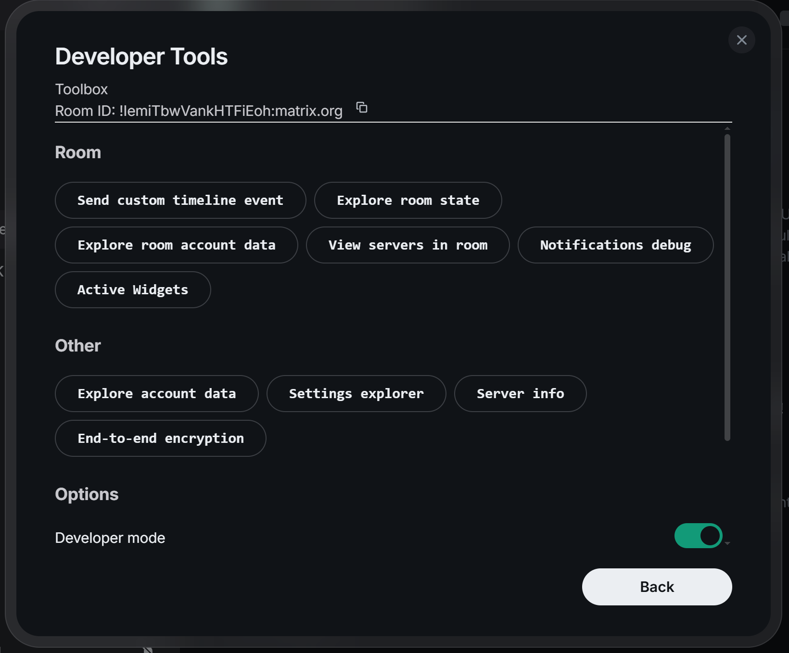

#### 订阅器

我们应该被动地订阅事件，而不是主动拉取, 因为我们根本无法知晓何时主动拉取,
`matrix-sdk` 有些预实现的订阅器:
```rust
// 订阅验证状态.
let mut verification_state_subscriber = client.encryption().verification_state();
// 订阅所有房间的事件.
let all_room_updates_receiver = client.subscribe_to_all_room_updates();
// 订阅某个房间的事件.
let some_room_updates_receiver = client.subscribe_to_room_updates(room_id);
// 订阅房间内所有正在打字的用户的提示.
let typing_notifications_receiver = client.subscribe_to_typing_notifications();
```

还有很不同类型事件的的订阅器类型 `matrix-sdk` 没有预实现, 但是我们可以传类型自己实现, 比如 `m.direct`, 它是一个 `GlobalAccount` 类型的事件:
```rust
let direct_event_content_subscriber = client.observe_events::<GlobalAccountDataEvent<DirectEventContent>, ()>().subscribe();
```

通过向 `Client::observe_events` 方法传递具体类型, 我们几乎可以获得 Matrix 中任意类型的事件订阅器.

----

#### 时间线中的图像质量
当用户在时间线里上传了一张足够不清晰的图片时, Matrix Server 不会为它生成一张缩略图.
也就是说, 时间线里的一张图片, 原图版本一定存在, 缩略图版本则可能存在.

在Robrix里, 我们的目的是:
- 在时间线里显示缩略图(400x400)格式, 如果没有缩略图, 则显示原图的(400x400格式)
- 在图片查看器里显示原图(最佳质量)格式.

先来看看 matrix-sdk 里的 `MediaRequestParameters` 的定义:
```rust
pub struct MediaRequestParameters {
    /// The source of the media file.
    pub source: MediaSource,

    /// The requested format of the media data.
    pub format: MediaFormat,
}
```
`MediaSource` 相当于 uri, `MediaFormat` 则是一个枚举, 内含多种不同的格式.

也就是说, 如果明确地想要拉取某一张图片, 指只有 uri 还不行, 还必须指定一个格式.

这也是我们 `try_get_media_or_fetch` 所做的事情, 看此函数签名的就知道了:
```rust
pub fn try_get_media_or_fetch(
    &mut self,
    mxc_uri: OwnedMxcUri,
    requested_format: MediaFormat,
)
{
    ...
}
```

----

#### 不要过分关注 sdk 内部细节:
不要过分关注 `matrix-sdk` 内部细节, 要多关注它暴露出来了哪些方法和函数, 比如说
[Highlight all messages that mention or reply to the current user, even if that message does not set the mentions field](https://github.com/project-robius/robrix/pull/430)

在这里我们自己实现了一个函数, 确定哪些消息应该高亮:
```rust
fn does_message_mention_current_user(
    message: &MessageOrSticker,
) -> bool {
    let Some(current_user_id) = sliding_sync::current_user_id() else {
        return false;
    };

    match message {
        // This covers both direct mentions ("@user"), @room mentions, and a replied-to message.
        MessageOrSticker::Message(msg) => {
            msg.mentions().is_some_and(|mentions|
                mentions.room || mentions.user_ids.contains(&current_user_id)
            )
        }
        MessageOrSticker::Sticker(_) => false, // Stickers can't mention users.
    }
}
```

也就是说, 如果消息中有提及所有人或者当前用户, 消息高亮:
```rust
msg.mentions().is_some_and(|mentions|
    mentions.room || mentions.user_ids.contains(&current_user_id)
)
```

但是, 这其实是我们自以为是的逻辑, `matrix-sdk` 的 timeline 是非常复杂的, 使用上述的方法, 我发现有些消息提及用户的消息根本无法高亮,
问了 `matrix-sdk` 那边, 才知道早有一个 `EventTimelineItem::is_highlighted()` 方法, 它完美除处理了所有的情况.

我们自己实现的代码费力不讨好, 所以今后要对接 matrix 的 功能的时候, 一定要先在 `matrix-sdk` 那边问.

#### 调试与测试

我们可以自己编写 mini cli client 用于测试, 比如说我可以搭建一个 [mini cli client](https://github.com/aaravlu/matrix-client-cli),
用于不断地切换房间的 `direct` 属性, 然后在 Robrix 里查看 RoomsList 是否有及时更新:
```rust
#[tokio::main]
async fn main() {
    let client = Client::builder()
        .server_name_or_homeserver_url("https://matrix-client.matrix.org/")
        .handle_refresh_tokens()
        .build()
        .await
        .expect("build client error");

    client
        .matrix_auth()
        // type your id & passwd here.
        .login_username("", "")
        .initial_device_display_name("test-client")
        .send()
        .await
        .expect("send request error");

    client
        .sync_once(SyncSettings::default())
        .await
        .expect("sync error");

    println!("Login success");

    let room_ruma = client.get_room(
        &OwnedRoomId::from_str("!veagCdDBjKrMsOCzrq:privacytools.io").expect("parse roomid error"),
    );
    let room_rust_ebd = client.get_room(
        &OwnedRoomId::from_str("!BHcierreUuwCMxVqOf:matrix.org").expect("parse roomid error"),
    );

    let mut direct = false;
    let client = &client;

    loop {
        let Some(room_ruma) = room_ruma.as_ref() else {
            println!("Empty room");
            continue;
        };

        let Some(room_rust_ebd) = room_rust_ebd.as_ref() else {
            println!("Empty room");
            continue;
        };

        room_ruma
            .set_is_direct(direct)
            .await
            .expect("error when setting direct");

        room_rust_ebd
            .set_is_direct(direct)
            .await
            .expect("error when setting direct");

        direct = !direct;
        client
            .sync_once(SyncSettings::default())
            .await
            .expect("sync error");
        println!("Set succcess");
    }
}
```

但是如果我们想进行别的测试, 就要定制各种不同的cli client, 这样就会过于繁琐.

Element 实际提供了各种各样的请求发送的方法, 打开 Element, 在任意房间输入 `/devtools`, 开启开发者模式.




即可发送任意事件类型的请求:


